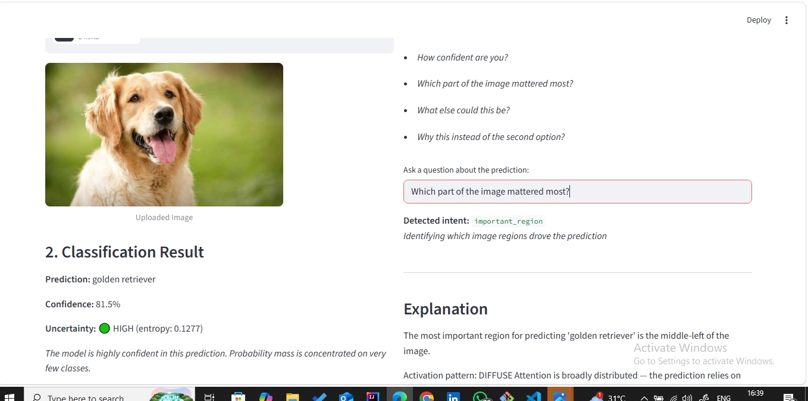
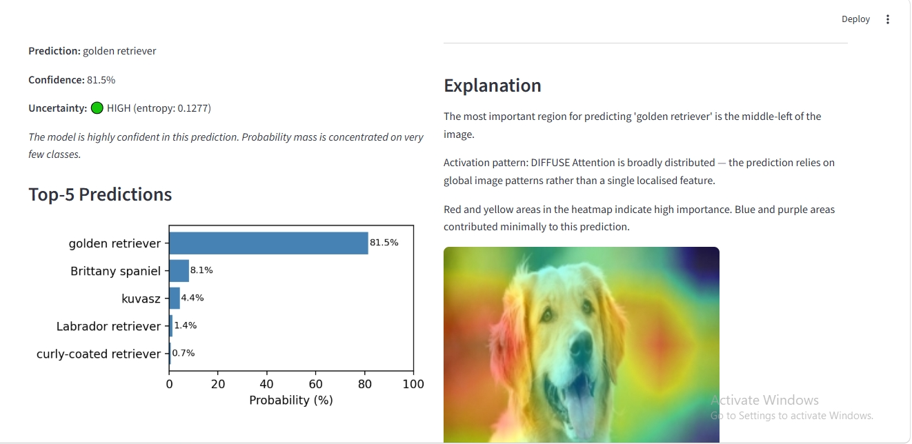

# Human-Centered Explainable Vision System

> Most image classifiers return only labels and confidence scores.
> While technically accurate, these outputs often fail to communicate
> *why* a prediction was made or *how* users should interpret
> uncertainty. This project explores a human-centered approach to
> image classification by combining visual explanations,
> confidence-aware uncertainty modeling, and structured query
> interaction.

---

## Motivation

Standard image classifiers produce outputs of the form:
Prediction: golden retriever
Confidence: 81.5%

This output is statistically informative but interactively hollow.
A user receiving this result cannot determine:
- Which visual features drove the prediction
- Whether the confidence score reflects genuine certainty or
  distributional ambiguity
- What alternative interpretations the model considered
- Whether the prediction should be trusted for their specific use case

This project is built around a single question:
**What would it mean for a classifier to not just predict, but explain?**

The system is deliberately constrained. Interaction is structured
through five predefined explanation intents rather than open-ended
natural language. This constraint is intentional — a more
interpretable interaction architecture for a project about
interpretability.

---

## System Overview
User uploads image
↓
ResNet50 (pretrained, inference only)
↓
Top-5 softmax predictions + entropy calculation
↓
Confidence band assignment (High / Cautious / Ambiguous)
↓
Grad-CAM heatmap generated for top prediction
↓
User submits structured query
↓
Query Interpreter (rule-based pattern matching)
↓
One of 5 intents detected
↓
Explanation Engine
↓
Visual output (heatmap) + Textual response

---

## Architecture

### 1. Classifier — `classifier.py`
Pretrained ResNet50 from torchvision. No fine-tuning.
Returns top-5 predictions with softmax probabilities and
the full 1000-class probability distribution for entropy
computation.

### 2. Uncertainty Module — `uncertainty.py`
Implements Shannon entropy over the full softmax distribution:

$$H(p) = -\sum_{i=1}^{n} p_i \log p_i$$

Normalised to [0, 1] against maximum entropy for 1000 classes
(log 1000). Mapped to three confidence bands:

| Band | Entropy Range | Interpretation |
|---|---|---|
| High | < 0.30 | Concentrated prediction |
| Cautious | 0.30 – 0.55 | Moderate spread |
| Ambiguous | > 0.55 | High distributional uncertainty |

Effective class count computed as exp(H) — the number of classes
carrying meaningful probability mass.

### 3. Grad-CAM — `gradcam.py`
Implemented from first principles following Selvaraju et al. (2017).
No external XAI library used.

$$L^c_{\text{Grad-CAM}} = \text{ReLU}\left(\sum_k \alpha_k^c A^k\right)$$

Where:
- $A^k$ = feature map k from ResNet50 layer4
- $\alpha_k^c = \frac{1}{Z}\sum_{ij} \frac{\partial y^c}{\partial A^k_{ij}}$
- ReLU retains only positively contributing regions

Forward and backward hooks registered on ResNet50's final
convolutional layer (layer4). Heatmap upsampled to 224×224
and overlaid on original image using JET colormap.

### 4. Query Interpreter — `query_interpreter.py`
Rule-based regex pattern matching across 5 structured intents.
No NLP library or transformer model used — intentionally.
A black-box query parser would contradict the project's
commitment to interpretable system design.

### 5. Explanation Engine — `explanation_engine.py`
Maps each detected intent to a specific combination of
visual and textual output, populated with real model values.

---

## Explanation Intents

### Intent 1 — `why_prediction`
*"Why did you classify this?"*

Returns Grad-CAM heatmap highlighting regions that drove
the prediction, with textual description of attention pattern
and peak activation region.

---

### Intent 2 — `confidence`
*"How confident are you?"*

Returns entropy value, confidence band, effective class count,
and band-specific interpretation message.

---

### Intent 3 — `important_region`
*"Which part of the image mattered most?"*

Returns Grad-CAM heatmap with spatial description of peak
activation region (upper-left, central, lower-right etc.)
and focus pattern description (focused / moderate / diffuse).

---

### Intent 4 — `alternative_prediction`
*"What else could this be?"*

Returns top-3 alternative predictions with probabilities
and assessment of whether top-2 gap indicates meaningful
inter-class uncertainty.

---

### Intent 5 — `comparison`
*"Why this instead of the second option?"*

Runs Grad-CAM independently for top-1 and top-2 predictions.
Returns side-by-side heatmaps with description of whether
attention regions differ or overlap between the two classes.

---

## Uncertainty Modeling

Entropy computed over the full 1000-class softmax distribution.
Normalised entropy of 0.0 indicates a perfectly certain prediction
(all probability mass on one class). Normalised entropy of 1.0
indicates maximal uncertainty (probability spread equally across
all 1000 classes).

Effective class count exp(H) provides an intuitive summary:
a value of 2.4 means the model is effectively choosing between
approximately 2-3 classes, regardless of which specific classes
those are.

---

## Evaluation

25 images evaluated across 5 categories of increasing visual
complexity. Full results in `evaluation/evaluation_log.csv`.
Methodology and observations in `evaluation/observations.md`.

### Summary Table

| Category | N | Avg Entropy | Avg Top-1 Prob | Diffuse Heatmaps |
|---|---|---|---|---|
| Clear | 3 | 0.0939 | 0.7905 | 1/3 |
| Moderate | 5 | 0.2324 | 0.5693 | 2/5 |
| Cluttered | 5 | 0.3658 | 0.5217 | 5/5 |
| Similar | 5 | 0.0652 | 0.8281 | 4/5 |
| OOD | 4 | 0.4207 | 0.3414 | 1/4 |

### Key Findings

**O1 — Entropy tracks visual complexity monotonically**
Normalised entropy increased consistently from clear (0.0939)
through moderate (0.2324) to cluttered (0.3658) and OOD (0.4207).
Entropy functions as a reliable proxy for image-level uncertainty.

**O2 — Cluttered images universally produced diffuse Grad-CAM activation**
All 5 cluttered images produced diffuse heatmaps (5/5).
When scenes contain multiple objects or busy backgrounds,
the model cannot localise attention — activation spreads broadly.
Visual complexity degrades spatial interpretability as well
as confidence.

**O3 — Confidence and attention focus are partially independent**
Several high-confidence predictions produced diffuse Grad-CAM maps.
Entropy-based confidence and Grad-CAM spatial focus capture
different properties of model behaviour. Reporting only a
confidence score would miss this distinction entirely.

**O4 — Inter-class similar images showed unexpectedly low entropy**
Similar category avg entropy (0.0652) was lower than clear images
(0.0939). The model commits decisively even on visually confusable
pairs. Low entropy reflects model commitment, not correctness.

**O5 — OOD images correctly triggered high uncertainty**
Out-of-distribution inputs produced the highest average entropy
(0.4207) and lowest top-1 probability (0.3414). The uncertainty
module correctly flagged these with cautious or ambiguous bands.

**O6 — One clear-category image misclassified with moderate confidence**
red_apple classified as strawberry (37.5%, high band).
Confidence bands reflect distributional certainty, not
ground-truth correctness. This is a known limitation of
softmax-based uncertainty estimation.

---

## Current Limitations

1. **Grad-CAM explanations are correlational, not causal.**
   Highlighted regions influenced the prediction within the
   model's learned representation — they do not constitute
   a causal account of why the image belongs to that class.

2. **Rule-based interaction limits linguistic flexibility.**
   The query interpreter recognises 5 structured intents via
   regex pattern matching. Queries outside these patterns
   return an unknown response. This is a deliberate design
   constraint, not an oversight.

3. **Softmax confidence is not perfectly calibrated uncertainty.**
   ResNet50 is known to be overconfident. Normalised entropy
   provides a better uncertainty signal than raw top-1 probability,
   but is still derived from an uncalibrated softmax distribution.

4. **Explanations inherit biases from pretrained ImageNet representations.**
   The model was trained on ImageNet. Predictions and Grad-CAM
   activations reflect ImageNet class boundaries, which may not
   align with human conceptual categories.

5. **Evaluation is qualitative and small-scale.**
   25 images across 5 informal categories. Findings are
   observational, not statistically validated.

---

## Future Work

- **Calibrated Bayesian uncertainty** using Monte Carlo Dropout
  or temperature scaling for better-calibrated confidence estimates
- **User-adaptive explanations** that adjust verbosity and
  visual complexity based on inferred user expertise
- **Multimodal interaction** extending the query interface
  to accept image regions as input alongside text queries
- **LLM-assisted explanation refinement** as a post-processing
  layer over the structured explanation engine outputs

---

## Technical Stack

| Component | Technology |
|---|---|
| Classifier | ResNet50 (torchvision, pretrained) |
| Grad-CAM | Implemented from scratch (PyTorch) |
| Uncertainty | Shannon entropy (NumPy/PyTorch) |
| Query Interpretation | Rule-based regex (Python re) |
| Interface | Streamlit |
| Visualisation | OpenCV, Matplotlib |

---

## Project Structure

human-centered-explainable-vision/
├── app.py                    # Streamlit interface
├── classifier.py             # ResNet50 inference
├── gradcam.py                # Grad-CAM (from scratch)
├── query_interpreter.py      # Intent detection
├── explanation_engine.py     # Response generation
├── uncertainty.py            # Entropy + confidence bands
├── utils.py                  # Image processing utilities
├── evaluation/
│   ├── run_evaluation.py     # Evaluation script
│   ├── evaluation_log.csv    # Per-image results
│   ├── observations.md       # Written observations
│   └── test_images/          # 25 evaluation images
├── screenshots/              # UI screenshots
├── requirements.txt          # Dependencies
└── README.md

---

## Reference

Selvaraju, R.R., Cogswell, M., Das, A., Vedantam, R., Parikh, D.,
& Batra, D. (2017). Grad-CAM: Visual Explanations from Deep Networks
via Gradient-based Localization. *ICCV 2017*.

---

*Built to investigate the gap between model confidence and human
interpretability. Grad-CAM implemented from first principles.*

